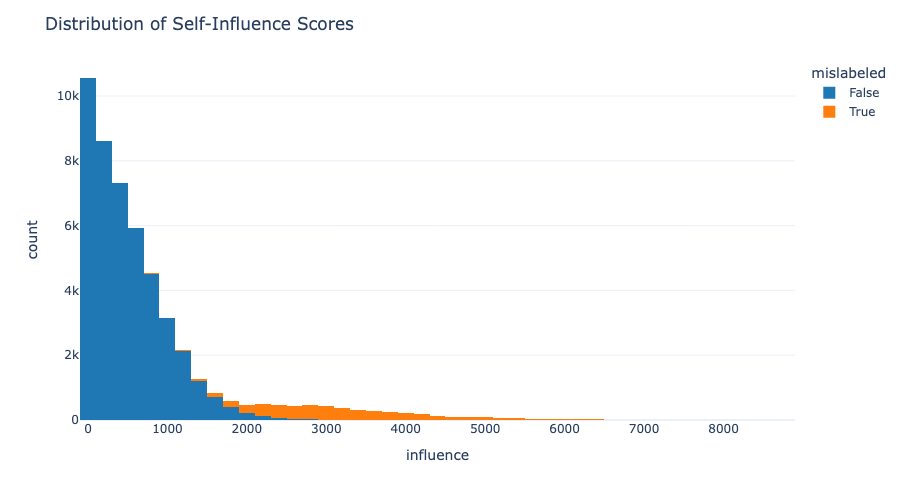

# TracInCP Summary – Practical Influence Estimation and Dataset Cleaning Pipeline

The **TracInCP pipeline** is a practical implementation of the *TracIn* method (Pruthi et al., 2020) for estimating how individual training samples influence model behavior.  
It adapts TracIn for **PyTorch**, adds **visualization**, **evaluation**, and **dataset cleaning** capabilities, and supports **modern dataset interfaces** such as HuggingFace and PyTorch datasets.

The pipeline computes **self-influence** or **cross-sample influence** using gradient similarity across checkpoints, and produces interpretable metrics and Plotly-based visualizations.

---

## Main Deviations from the Original TracIn

- **Dataset:** Detection rate tested on **CIFAR-100** instead of CIFAR-10 (as in the original paper).  
- **Model accuracy:** ResNet-56 achieves ~70% training accuracy on CIFAR-100, significantly lower than on CIFAR-10.  
- **Checkpoint weighting:** Default `η` values are **1.0** for all checkpoints, instead of scaling by learning rate.  

These choices simplify implementation while maintaining the relative behavior and interpretability of influence scores.

---

## Metrics and Evaluation

To enable quantitative mislabeled detection and method comparison, TracInCP adds the following metrics:

- **Precision@k** — Fraction of the top-k% most influential examples that are mislabeled.  
- **Recall@k (Recovery Curve)** — Fraction of all mislabeled examples found within the top-k%.  
- **AUC (Recovery)** — Area under the recall curve.  

These metrics allow comparison across different checkpoints, influence computation modes, and subset selection methods.

---

## Experimental Notes

Experiments were conducted on **CIFAR-10** and **Noisy CIFAR-100** with **ResNet-56** trained for 300 epochs.  
Influence scores were aggregated from multiple checkpoints (every 30 epochs), and evaluated across the following setups:

- Using **all** vs. only the **last two** checkpoints.  
- Subset selection via **percentile**, **knee**, and **GMM** methods.  
- Influence computed on the **final layer** vs. the **entire network**.  

**Findings:**
- Using multiple checkpoints improves recall stability.  
- Last-layer influence retains interpretability with reduced computation.  
- Recovery curves closely match the patterns observed in the original TracIn paper.

---

## Dataset Cleaning Insights

TracInCP identifies and removes **proponents** — samples with **high self-influence** — since mislabeled examples often have disproportionately large gradient norms.  
Thus, cleaner datasets can be obtained by **keeping lower-influence examples**.

Three cutoff strategies were compared:
1. **Percentile thresholding** (most consistent and interpretable).  
2. **Knee detection** (adaptive elbow-based).  
3. **GMM clustering** (statistical separation of influence modes).  

The **percentile** method provided the most balanced results.
---

## Further Work and Analysis

Potential extensions include:
- Evaluating influence transfer across *similar but not identical* datasets.  
- Studying behavior under systematic label noise — training the base network on data containing mislabeled samples (simulating real-world noise)
- Correlating influence with *model confidence* and uncertainty measures.  
- Assessing the impact of *final accuracy* on influence stability.  
- Re-training on *clean subsets* to measure improvements in generalization.

The modular design of TracInCP supports these extensions with minimal modification.

---

## Results Overview

### Influence Score Distribution

The following histogram shows the distribution of self-influence values across the noisy CIFAR-100 dataset, revealing the presence of high-influence samples:

### Recovery Curve

The recovery curve shows the rate at which TracInCP recovers mislabeled examples as a function of the fraction of the dataset inspected.

### Precision–Recall Analysis

This precision-recall curve shows the trade-off between precision and recall when selecting the top-k% most influential examples:

### Dataset Cleaning Methods Comparison

Comparison of different subset selection methods (percentile, knee, GMM) for identifying clean data subsets:

